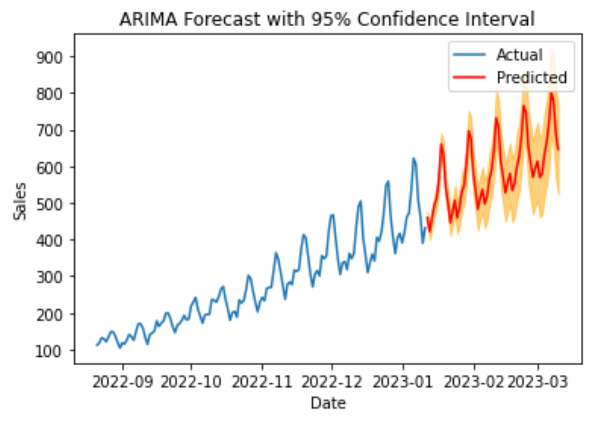

# Documentation of the Model Development Process

### The Goal:
Forecasting future total sales of ABCD's items based on the historical total sales.

### Data:  
The data is day-to-day total sales of ABCD's items from 21.08.2022 to 01.11.2023. It includes 144 datapoints.  
No pre-processing steps were needed for the data, it didn't include any missing or outlier values.  

### Feature Engineering:  
Feature Engineering was done for the LSTM and Prophet. Lagged sales from 1 to 5 days were added and rolling mean of 5, 10, 15 and 20 days' sales were added. It did not improve performance.  

### Model Selection:
There are many models that can be used for Time-Series forecasting. These include Linear Regression, ARIMA, Random Forest, XGBoost,
LSTM, DeepAR and Prophet. In this project all of these were tried except DeepAR. LSTM, Prophet and ARIMA were fine-tuned further. After fine-tuning and feature engineering ARIMA turned out to be the most accurate of these.  
Prophet: 55.80 MAE (and odd looking prediction)  
LSTM: 39.28 MAE  
ARIMA: 23.56 MAE  

### Evaluation:
For evaluation Mean Absolute Error (MAE) was used.

### Results:
The MAE of the ARIMA model was 23.56, this means the model's prediction from the actual sales in the test set was off by 23.56 points on average. The model also gives a 95% confidence interval of the predictions. This means that there's a 95% chance the true value lies between these intervals.  

### Deployment:
An API endpoint could be created that takes input data and returns the model's prediction.

Once the model is deployed, it is important to monitor its performance. This can be done by tracking the MAE to ensure that the model is performing as expected.

Regular maintenance of the model is important to ensure that it continues to perform well. This includes e.g. retraining with new data and updating model parameters.

An alerting system should be set up which will notify the team if the model's performance drops below a certain threshold.

A log of all the requests and predictions made by the model should be kept, this will be helpful in monitoring and debugging the model.

### Additional Information:
For LSTM, ARIMA and Prophet you can see the development in different .ipynb -files and the best ARIMA model is sales_model.sav. You can use that for the predictions.
